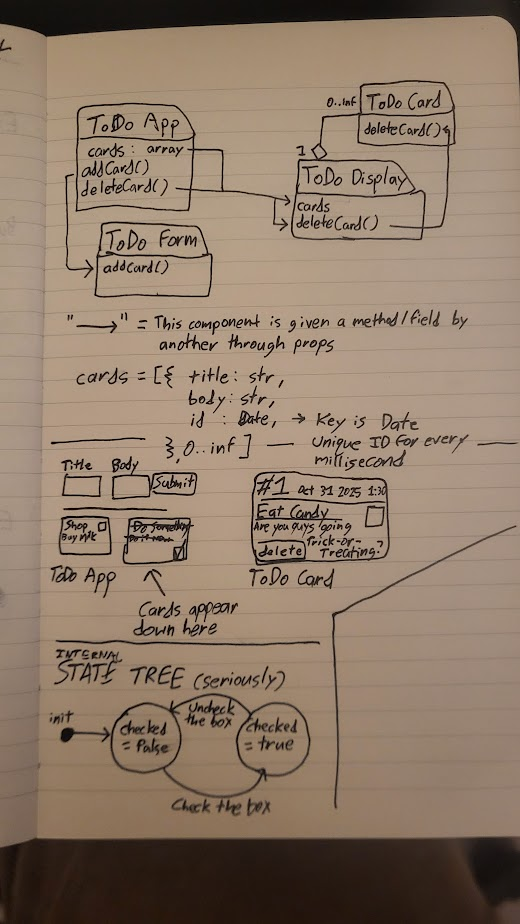

# project-3
## React demonstration: ToDo App

React app hosted on GitHub pages containing a simple ToDo creator. Create tasks via "To-Do cards" using the form and keep track of stuff that needs to get done. When you complete something, check the box and the text gets crossed out. 

You can delete cards if you typed something wrong.

**Technologies used:**
- React.js
- Vite (for deployment)
- gh-pages NPM package
- HTML, CSS, et. al.

**Technologies not used:**
- TypeScript

**USER STORIES**
I am an... *ORGANIZED PERSON*
trying to... *COMPLETE MY OLDEST TASKS FIRST*
so I can... *GET THE MOST IMPORTANT STUFF DONE*
(Tasks are timestamped and the oldest are displayed first)

I am a... *BUSY PERSON*
trying to... *CREATE A LOT OF TASKS*
so I can... *GET STUFF DONE*
(Tasks are dynamically added to the page and there is no limit to the amount of tasks that can be created)

I am a... *LOUSY TYPER*
trying to... *REMOVE A TASK*
so I can... *SUBMIT A NEW ONE THAT IS SPELLED CORRECTLY*
(You can remove tasks)

**IDEAS FOR FUTURE IMPROVEMENT:**
- Sort tasks by checked/unchecked. This was part of the original technical requirements for the project but I could not for the life of me figure out how to do it.
- Buttons to move tasks up/down the list of tasks
- A way to edit a task instead of deleting it and resubmitting it

